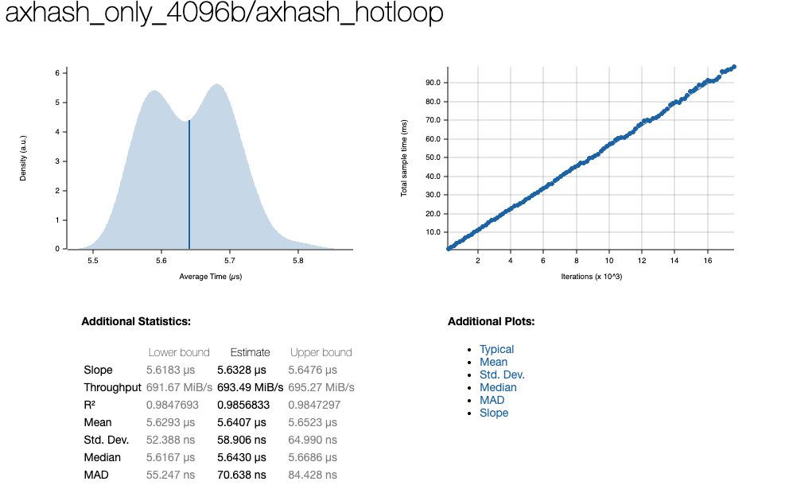
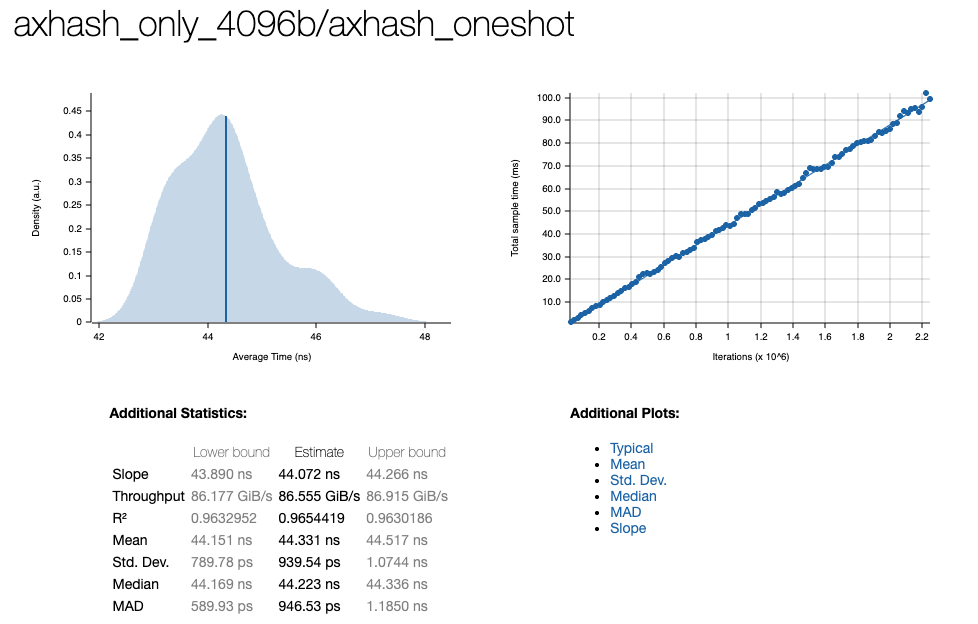
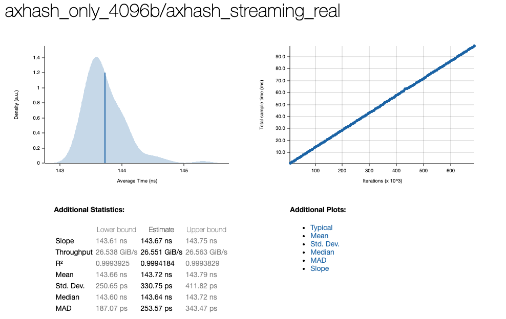

# AxHash

AxHash is a fast, deterministic hashing family for Rust, C/C++.

If you only need AxHash in Rust, start with the `axhash` crate from this workspace. It is the simplest entrypoint and re-exports the core engine with a friendlier import path.

## Pick The Right Package

- Rust: `axhash`
- C / C++ / Go / Zig / Swift / Kotlin Native: `axhash-ffi`
- Internal engine / `no_std`: `axhash-core`

## Rust Quick Start

Add the simplest Rust package:

```toml
[dependencies]
axhash = "0.4.3"
```

Hash raw bytes:

```rust
use axhash::hash;

fn main() {
    let digest = hash(b"hello axhash");
    println!("{digest:016x}");
}
```

Hash raw bytes with a seed:

```rust
use axhash::hash_with_seed;

fn main() {
    let digest = hash_with_seed(b"hello axhash", 0x1234_5678);
    println!("{digest:016x}");
}
```

Hash any Rust value that implements `Hash`:

```rust
use axhash::hash_value;

#[derive(Hash)]
struct SessionKey {
    account_id: u64,
    region_id: u32,
    flags: u32,
}

fn main() {
    let key = SessionKey {
        account_id: 42,
        region_id: 7,
        flags: 3,
    };

    let digest = hash_value(&key);
    println!("{digest:016x}");
}
```

Use the streaming hasher:

```rust
use axhash::Hasher;
use std::hash::Hasher as _;

fn main() {
    let mut hasher = Hasher::new_with_seed(0x4444);
    hasher.write(b"hello ");
    hasher.write(b"world");

    println!("{:016x}", hasher.finish());
}
```

Use AxHash with `HashMap`:

```rust
use axhash::BuildHasher;
use std::collections::HashMap;

fn main() {
    let mut map = HashMap::with_hasher(BuildHasher::with_seed(0xfeed_beef));
    map.insert("status", "ok");
    map.insert("runtime", "fast");

    println!("{:?}", map.get("status"));
}
```

Inspect the active backend:

```rust
use axhash::{runtime_backend, runtime_has_aes};

fn main() {
    println!("{:?}", runtime_backend());
    println!("{}", runtime_has_aes());
}
```

## Workspace Layout

- [axhash-core](crates/axhash-core/README.md): low-level Rust core and `no_std` engine
- [axhash-ffi](crates/axhash-ffi/README.md): stable C ABI

## Benchmarks

Internal Criterion screenshots:





## License

MIT.
